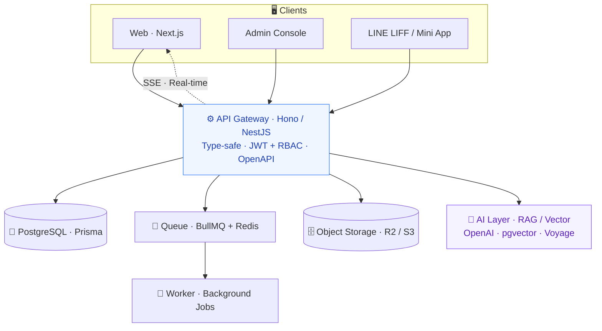

<div align="center">

# มูฮัมหมัดฮีซาม ปาล๊ะ (ซัง)

### Mid-level Backend Developer
**System Architecture · Scalable & Secure APIs · End-to-End Ownership**

ออกแบบสถาปัตยกรรมและพัฒนา RESTful API สำหรับระบบระดับ Production ข้าม 4 อุตสาหกรรม —
HealthTech · Energy · Enterprise · Digital Platform

<br/>


[](https://github.com/muhammmadhisam/profile-muhammadhisam)
[](https://linkedin.com/in/muhammadhisam-pala-45b83825a)
[](mailto:muhammadhisam.pala@gmail.com)

</div>

---

## 👋 เกี่ยวกับผม

ผมเป็น Backend Developer ที่ทำงานครบตั้งแต่เก็บ requirement, ออกแบบระบบและฐานข้อมูล, เขียน API ไปจนถึง deploy และดูแลระบบบน production

ตลอด 5+ ปีที่ผ่านมา ทำงานข้ามหลายอุตสาหกรรม และได้ลองใช้สถาปัตยกรรมหลายแบบ —
Microservices, Multi-tenant SaaS, Event-driven, Queue และ AI/RAG — กับโจทย์ธุรกิจ SME ไทยจริง

| | |
|---|---|
| 🗓️ **5+ ปี** ในสายพัฒนา | 🚀 **10+ ระบบ** ขึ้น Production |
| 🏭 **4 อุตสาหกรรม** ที่เคยส่งมอบ | 🔁 **End-to-End** Requirement → Deploy |

---

## 🏗️ แนวทางการออกแบบระบบ (Production Blueprint)

สถาปัตยกรรมที่ผมใช้ซ้ำในหลายโปรเจกต์ — Monorepo แยก App ชัดเจน, API แบบ type-safe,
งานหนักโยนเข้า Queue, และรองรับ Real-time / AI ในเลเยอร์เดียวกัน



---

## 💼 ผลงานเด่น (Work)

| Project | สรุป | Stack |
|---------|------|-------|
| **ERC — Centralized Energy Data Platform** | รวมข้อมูลไฟฟ้าระดับประเทศจากหลายแหล่งเข้าสู่ dashboard เดียว ประมวลผลแบบ near real-time | `NestJS` `Microservices` `PostgreSQL` |
| **Pool Manager — Gas Pool Management** | คำนวณต้นทุนก๊าซจากหลายแหล่งจัดหา (LNG/Gulf/Myanmar) พร้อม Cost Allocation & Pricing Workflow | `Cost Engine` `Audit Trail` |
| **Verso PO/PR — Procurement Workflow** | จัดซื้อครบวงจร Multi-Level Approval + Budget Validation ตามหลัก Internal Control | `Approval Flow` `Budget Control` |
| **[Prolab — Health Service Platform](https://ai.prolab.co.th/th)** 🔗 | AI Health Analytics ช่วยแพทย์ประเมินความเสี่ยง + ปรับ Lab Result System (ลดเวลารอผล 3–7 → 1–3 วัน) | `AI Analytics` `HL7` `LAB System` |
| **ICMT — Device Registration** | ลงทะเบียน/ยืนยันอุปกรณ์โทรศัพท์ด้วย IMEI แยก Web/Admin/Storage/Worker | `Turborepo` `Next.js 14` `Hono` `Prisma` `Redis` |

---

## 🧪 Side Projects — *Currently Building* 🟢

โปรเจกต์ที่พัฒนานอกเวลางาน เพื่อแก้ปัญหาธุรกิจ SME ไทยจริง และทดลองสถาปัตยกรรมระดับ Production

| Project | Highlight | Stack |
|---------|-----------|-------|
| **[StockSook](https://stocksook.pixelranklab.com/)** 🔗 | SaaS ERP + POS สำหรับ SME ไทย เข้าใช้ผ่าน LINE Mini App ไม่ต้องติดตั้ง | `Turborepo` `Next.js 15` `Hono` `PostgreSQL` `LINE LIFF` |
| **[Clinic ERP](https://erp-clinic.pixelranklab.com/)** 🔗 | Multi-tenant B2B SaaS 6 Microservices · fp-ts · SuperTokens | `Hono 4` `fp-ts` `BullMQ` `Cloudflare R2` |
| **M-MERT** | ระบบสั่งการกู้ภัยการแพทย์ฉุกเฉิน Real-time (SSE) · response < 10ms | `Bun` `Hono 4` `Effect` `SSE` `JWT+RBAC` |
| **[MeawSook](https://meawsook.com/)** 🔗 | แมวหาย + บริจาคอาหารโปร่งใส · AI จับคู่ใบหน้าแมวด้วย Vector Search | `Voyage MM-3` `pgvector` `LINE LIFF` |
| **[MoveSook](https://movesook.com/)** 🔗 | Two-sided marketplace เรียกคนขับขนย้าย On-demand · end-to-end type-safe RPC | `Next.js` `Hono` `Prisma` `Zod` `Turborepo` |
| **Clinic Booking + AI Chatbot** | จองคิวคลินิก + ผู้ช่วย AI แบบ RAG ตอบจากฐานข้อมูลจริง | `OpenAI` `Milvus` `LINE LIFF` `MinIO` |
| **SE Ranking Scraper API** | ดึงข้อมูล SEO อัตโนมัติด้วย Stealth Browser + Job Queue | `Bun` `Playwright Stealth` `BullMQ` `ExcelJS` |
| **EMS-ECI** | ระบบบันทึกผู้ป่วย & Checklist สำหรับพยาบาล ทดแทนกระดาษ | `Next.js 16` `Prisma 7` `better-auth` `ExcelJS` |

---

## 🧰 Tech Stack

**Backend**


**Frontend**


**Database & ORM**


-00A1EA?style=flat&logoColor=white)

**DevOps & AI**


**Architecture & Concepts** · System Design · Microservices · Multi-tenant SaaS · Event-driven · RAG / Vector Search · API Security · RBAC

---

## 📫 ติดต่อ

- 📧 **Email** — [muhammadhisam.pala@gmail.com](mailto:muhammadhisam.pala@gmail.com)
- 💼 **LinkedIn** — [muhammadhisam-pala](https://linkedin.com/in/muhammadhisam-pala-45b83825a)
- 💬 **Line** — hisam023
- 📱 **Phone** — 090-163-0867

---

<details>
<summary>📄 <b>เกี่ยวกับ Repo นี้</b> — Source ของหน้า Portfolio</summary>

<br/>

Repo นี้คือ source code ของหน้าเว็บ Resume / Portfolio แบบ Single Page —
สร้างด้วย **Tailwind CSS** สไตล์ [shadcn/ui](https://ui.shadcn.com/) โทนน้ำเงิน สะอาด และ responsive ทุกหน้าจอ
รวมถึง **inline SVG architecture diagram** ของโปรเจกต์เด่น (Clinic ERP · M-MERT · MeawSook)

**Tech:** HTML5 · Tailwind CSS (CDN) · Vanilla JS · Google Fonts (Sarabun + Inter)

```bash
# Clone & run
git clone https://github.com/muhammmadhisam/profile-muhammadhisam.git
cd profile-muhammadhisam

open index.html            # เปิดตรง ๆ
# หรือรันผ่าน local server
python3 -m http.server 8000
npx serve .
```

**Deploy** เป็น static site ได้กับ GitHub Pages · Netlify · Vercel · Cloudflare Pages (build command ว่าง)

</details>

<div align="center">

<sub>Built with ♥ in Thailand</sub>

</div>
