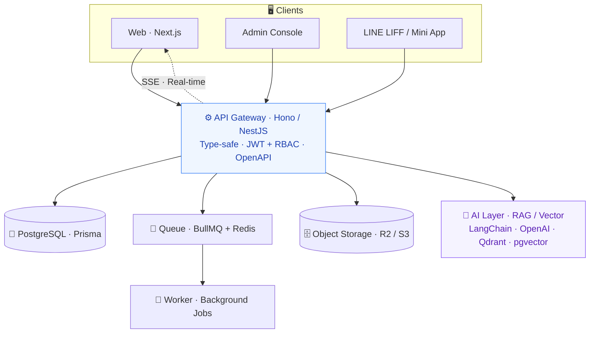

<div align="center">

# มูฮัมหมัดฮีซาม ปาล๊ะ (ซัง)

### Mid-level Backend Developer
**REST API · Database Design · Real-time & Queue · DevOps**

ออกแบบและพัฒนา RESTful API ให้ระบบที่ใช้งานจริง —
งานสาย HealthTech, Energy และระบบภายในองค์กร

<br/>


[](https://github.com/muhammmadhisam/profile-muhammadhisam)
[](https://linkedin.com/in/muhammadhisam-pala-45b83825a)
[](mailto:muhammadhisam.pala@gmail.com)

</div>

---

## 👋 เกี่ยวกับผม

ผมเป็น Backend Developer ทำงานตั้งแต่คุย requirement, ออกแบบฐานข้อมูลและ API, เขียนโค้ด ไปจนถึง deploy และดูแลระบบหลังขึ้น production

5+ ปีที่ผ่านมาส่วนใหญ่อยู่กับงานสาย HealthTech, Energy และระบบภายในองค์กร
เคยทำทั้ง multi-tenant SaaS, งาน queue / background job, ระบบ real-time ด้วย SSE และช่วงหลังเริ่มทำงานสาย AI / RAG

| | |
|---|---|
| 🗓️ **5+ ปี** ในสายพัฒนา | 🚀 **10+ ระบบ** ที่ร่วมพัฒนาและใช้งานจริง |
| 🔁 ทำงานตั้งแต่ **Requirement → Deploy** | 🧩 ถนัดฝั่ง **Backend / API** |

---

## 🏗️ แนวทางการออกแบบระบบที่ใช้บ่อย

โครงที่ผมใช้ซ้ำในหลายโปรเจกต์ — Monorepo แยก App ชัดเจน, API แบบ type-safe,
งานหนักโยนเข้า Queue และรองรับ Real-time / AI ในเลเยอร์เดียวกัน


```mermaid
flowchart TD
    subgraph Clients["🖥️ Clients"]
        W["Web · Next.js"]
        A["Admin Console"]
        L["LINE LIFF / Mini App"]
    end

    W --> API
    A --> API
    L --> API

    API["⚙️ API Gateway · Hono / NestJS<br/>Type-safe · JWT + RBAC · OpenAPI"]

    API --> DB[("🐘 PostgreSQL · Prisma")]
    API --> Q["📨 Queue · BullMQ + Redis"]
    Q --> WK["🔧 Worker · Background Jobs"]
    API --> ST[("🗄️ Object Storage · R2 / S3")]
    API --> AI["🤖 AI Layer · RAG / Vector<br/>LangChain · OpenAI · Qdrant · pgvector"]
    API -. "SSE · Real-time" .-> W

    classDef api fill:#eff6ff,stroke:#3b82f6,color:#1e40af;
    classDef ai fill:#f5f3ff,stroke:#8b5cf6,color:#5b21b6;
    class API api;
    class AI ai;
```

---

## 💼 โปรเจกต์ที่ทำในนามบริษัท

งานเหล่านี้ทำกันเป็นทีม — ผมรับผิดชอบฝั่ง backend และ API เป็นหลัก

| Project | สรุป | Stack |
|---------|------|-------|
| **ERC — Centralized Energy Data Platform** | รวมข้อมูลไฟฟ้าจากหลายแหล่งเข้า dashboard เดียว สำหรับดูภาพรวมและ monitoring | `NestJS` `REST API` `PostgreSQL` `Data Pipeline` |
| **Pool Manager — Gas Pool Management** | คำนวณต้นทุนก๊าซจากหลายแหล่งจัดหา (LNG/Gulf/Myanmar) พร้อม Cost Allocation & Pricing Workflow | `Cost Engine` `Audit Trail` `PostgreSQL` |
| **[Prolab — Health Service Platform](https://ai.prolab.co.th/th)** 🔗 | ร่วมพัฒนา backend ของ AI Health Analytics + ปรับ Lab Result System (ทีมลดเวลารอผล 3–7 → 1–3 วัน) | `AI Analytics` `HL7` `LAB System` |
| **ICMT — ระบบบริการจัดการแท็บเล็ตเพื่อการศึกษา** | ทะเบียนทรัพย์สิน ยืม–คืน ตรวจรับคืน ตั๋วเคลมซ่อม และรายงานสถานะอุปกรณ์รายโรงเรียน แยก Web/Admin/Storage/Worker | `Turborepo` `Next.js` `Hono` `Prisma` `Redis` |

---

## 🤝 งานฟรีแลนซ์

รับงานอิสระ — ดูแลตั้งแต่คุย Requirement ออกแบบระบบ พัฒนา จนส่งมอบและขึ้นใช้งาน

| Project | สรุป | Stack |
|---------|------|-------|
| **VSDMS — ระบบบริหาร Visa และแจ้งเตือนสำหรับโรงเรียน** | ติดตาม Visa ของนักเรียนต่างชาติและผู้ติดตามผ่าน LINE LIFF แจ้งเตือนก่อนหมดอายุอัตโนมัติ ผู้ปกครองยื่นคำร้องต่ออายุและติดตามสถานะเองได้ — ออกแบบตาม PDPA เพราะเป็นข้อมูลของผู้เยาว์: เข้ารหัสระดับคอลัมน์ (AES-256-GCM + blind index + key rotation), เอกสารแนบแบบ envelope encryption, Audit Log ทุกการอ่าน/แก้, รองรับไทย/อังกฤษ · ดูแล server เอง: CrowdSec + firewall bouncer, Netdata + GoAccess ผูก localhost เข้าผ่าน SSH tunnel, แจ้งเตือนเข้า Telegram · ทำคนเดียวตั้งแต่ requirement ถึง production (4 apps · 9 packages · ~40 models) | `Turborepo` `Hono RPC` `Next.js` `Prisma` `PostgreSQL` `BullMQ` `LINE LIFF` `Docker` `Caddy` `CrowdSec` `Netdata` |
| **Verso PO/PR — Procurement Workflow** | ระบบจัดซื้อครบวงจร Multi-Level Approval + Budget Validation พร้อม Audit Trail ตามหลัก Internal Control | `Approval Flow` `Budget Control` `Audit Trail` |
| **M-MERT — ระบบสั่งการการแพทย์ฉุกเฉินทางทะเล** | ระบบสั่งการครบวงจร ครอบคลุมภารกิจ, Triage, คำสั่งแพทย์, ติดตามสัญญาณชีพ — push ข้อมูล Real-time ด้วย SSE พร้อมแผนที่ติดตามตำแหน่ง | `Hono 4` `Effect` `SSE` `Prisma` `Next.js` `Leaflet` |
| **Clinic Booking + RAG Chat** | ระบบจองคิวผ่าน LINE LIFF พร้อม AI Chat ตอบคำถามอัตโนมัติด้วย RAG ดึงข้อมูลจาก Vector DB | `RAG` `LangChain` `Qdrant` `OpenAI` `LINE LIFF` `Redis` `Prisma` `Sentry` |

---

## 🧪 Side Projects 🟢

โปรเจกต์ที่ทำนอกเวลางาน เพื่อฝึกออกแบบระบบและลองเทคโนโลยีใหม่ ๆ — บางตัวเปิดใช้จริงแล้ว บางตัวยังพัฒนาอยู่

| Project | Highlight | Stack |
|---------|-----------|-------|
| **[StockSook](https://stocksook.pixelranklab.com/)** 🔗 | ERP + POS ขนาดเล็กสำหรับร้าน SME เข้าใช้ผ่าน LINE Mini App | `Turborepo` `Next.js 15` `Hono` `PostgreSQL` `LINE LIFF` |
| **[Clinic ERP](https://erp-clinic.pixelranklab.com/)** 🔗 | Multi-tenant B2B SaaS แยกบริการ 6 ส่วน · fp-ts · SuperTokens | `Hono 4` `fp-ts` `BullMQ` `Cloudflare R2` |
| **[MeawSook](https://meawsook.com/)** 🔗 | แมวหาย + บริจาคอาหารที่ตรวจสอบย้อนหลังได้ · AI จับคู่ใบหน้าแมวด้วย Vector Search | `Voyage MM-3` `pgvector` `LINE LIFF` |
| **[MoveSook](https://movesook.com/)** 🔗 | Two-sided marketplace เรียกคนขับขนย้าย On-demand · end-to-end type-safe RPC | `Next.js` `Hono` `Prisma` `Zod` `Turborepo` |
| **EMS-ECI** | ระบบบันทึกผู้ป่วย & Checklist สำหรับพยาบาล ทดแทนกระดาษ | `Next.js 16` `Prisma 7` `better-auth` `ExcelJS` |

---

## 🧰 Tech Stack

**Backend**


**Frontend**


**Database & ORM**


-DC244C?style=flat&logo=qdrant&logoColor=white)


**DevOps & AI**


**Architecture & Concepts** · System Design · PDPA / Data Protection (Field-level & Envelope Encryption) · Multi-tenant SaaS · Queue / Background Job · Real-time (SSE) · RAG / Vector Search · Embedding & Retrieval Pipeline · API Security · RBAC

---

## 📫 ติดต่อ

- 📧 **Email** — [muhammadhisam.pala@gmail.com](mailto:muhammadhisam.pala@gmail.com)
- 💼 **LinkedIn** — [muhammadhisam-pala](https://linkedin.com/in/muhammadhisam-pala-45b83825a)
- 💬 **Line** — hisam023
- 📱 **Phone** — 090-163-0867

---

<details>
<summary>📄 <b>เกี่ยวกับ Repo นี้</b> — Source ของหน้า Portfolio</summary>

<br/>

Repo นี้คือ source code ของหน้าเว็บ Resume / Portfolio แบบ Single Page —
สร้างด้วย **Tailwind CSS** สไตล์ [shadcn/ui](https://ui.shadcn.com/) โทนน้ำเงิน สะอาด และ responsive ทุกหน้าจอ
รวมถึง **inline SVG architecture diagram** ของโปรเจกต์เด่น (Clinic ERP · M-MERT · MeawSook)

**Tech:** HTML5 · Tailwind CSS (CDN) · Vanilla JS · Google Fonts (Sarabun + Inter)

```bash
# Clone & run
git clone https://github.com/muhammmadhisam/profile-muhammadhisam.git
cd profile-muhammadhisam

open index.html            # เปิดตรง ๆ
# หรือรันผ่าน local server
python3 -m http.server 8000
npx serve .
```

**Deploy** เป็น static site ได้กับ GitHub Pages · Netlify · Vercel · Cloudflare Pages (build command ว่าง)

</details>

<div align="center">

<sub>Built with ♥ in Thailand</sub>

</div>
